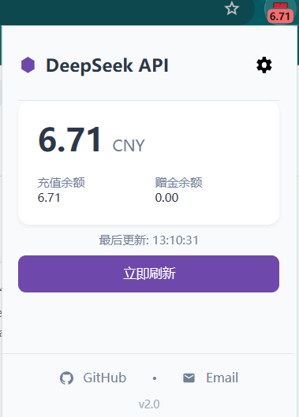

# 🔍 DeepSeek API 余额监控浏览器插件



📌 **功能**：
- 实时显示 DeepSeek API 余额
- 自动刷新数据
- 支持明暗主题

## 🚀 安装方法
1. **下载 ZIP**（点右边 `↓ Code` → `Download ZIP`）
2. 解压文件
3. 浏览器打开 `chrome://extensions`
4. 开启 **"开发者模式"**
5. 点击 **"加载已解压的扩展程序"**，选择解压的文件夹

## 📦 发布版本（Releases）
👉 [点击下载最新版v1.0.0](https://github.com/JoWer22/deepseek-monitor/releases)

## 🛠️ 开发
```bash
git clone https://github.com/JoWer22/deepseek-monitor.git
cd deepseek-monitor
